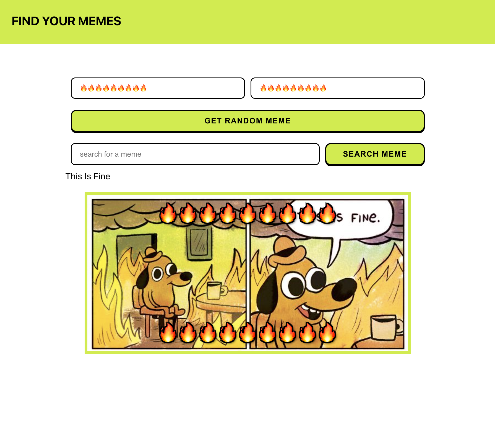

<a href="https://meme-generator-mcosme00.netlify.app/">🔗 Deployed site 🔗</a>

# ABOUT THIS PROJECT

This is a simple React App that is part of the Scrimba React course.
It fetches data from the meme API and shows random memes whenever the button is clicked.
I added a second form so that users can search for memes trough keywords.

## Next steps

- If the user search returns more than one image, create a Carrousel component

## App's view

## Getting Started with Create React App

This project was bootstrapped with [Create React App](https://github.com/facebook/create-react-app).
